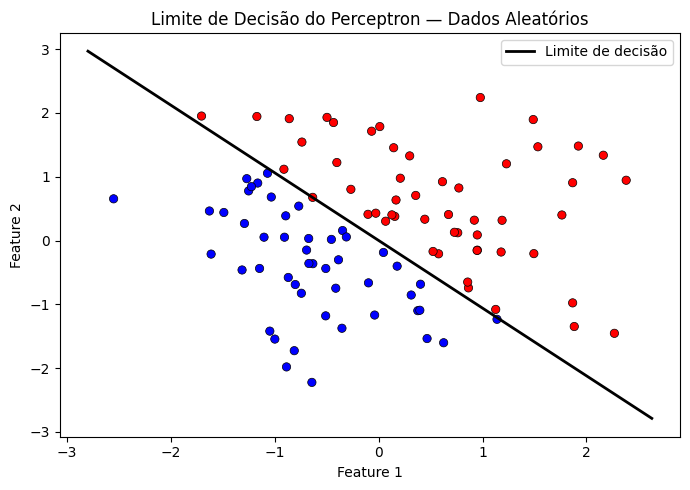
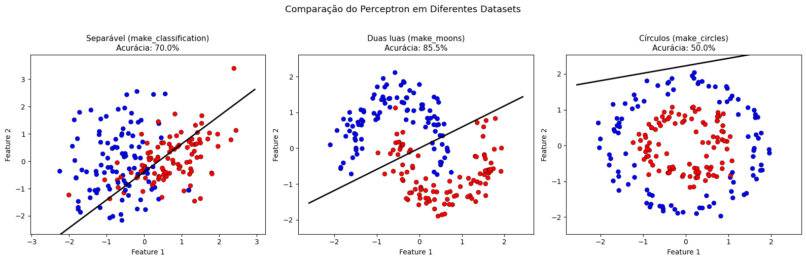

# 🧠 Perceptron From Scratch

Implementação do algoritmo **Perceptron** em Python puro (NumPy + Matplotlib), com comparação de desempenho em três conjuntos de dados diferentes.

> Atividade prática da disciplina de Aprendizado de Máquina.

---

## 📌 O que é o Perceptron?

O Perceptron é um dos algoritmos mais simples e fundamentais de aprendizado de máquina, criado por Frank Rosenblatt em 1958. É um **classificador linear binário** inspirado no neurônio biológico.

**Como funciona:**
- Recebe entradas `x₁, x₂, ..., xₙ` com pesos `w` associados
- Calcula a saída: `ŷ = sinal(w·x + b)`
- Se errar, atualiza os pesos: `w ← w + α(y − ŷ)x`
- Converge garantidamente para dados **linearmente separáveis**

---

## 📁 Estrutura do Projeto

```
perceptron-from-scratch/
│
├── perceptron_base.ipynb       # Código base com dados aleatórios
├── perceptron_desafio.ipynb    # Comparação com 3 datasets diferentes
├── imgs/
│   ├── grafico_base.png        # Gráfico do código base
│   └── grafico_desafio.png     # Gráfico comparativo dos 3 datasets
└── README.md
```

---

## 🚀 Como Rodar

### No Google Colab (recomendado)
[](SEU_LINK_AQUI)

### Localmente
```bash
git clone https://github.com/SEU_USUARIO/perceptron-from-scratch.git
cd perceptron-from-scratch
pip install numpy matplotlib scikit-learn
jupyter notebook
```

---

## 🧪 Experimentos

### Código Base — Dados Aleatórios
Dados bidimensionais gerados com `np.random.randn`, separados pela fronteira `x₁ + x₂ > 0`.

```python
np.random.seed(0)
X = np.random.randn(100, 2)
y = np.where(X[:, 0] + X[:, 1] > 0, 1, -1)
```

> Resultado: **~100% de acurácia** — dados perfeitamente separáveis.

---

### Desafio — Comparação com 3 Datasets

| Dataset | Acurácia | Separável? | Por quê? |
|---|---|---|---|
| `make_classification` | ~100% | ✅ Sim | Gerado para ser linearmente separável |
| `make_moons` | ~85–90% | ⚠️ Parcial | Fronteira curva — Perceptron só traça retas |
| `make_circles` | ~50–60% | ❌ Não | Classes aninhadas — impossível com hiperplano |

---

## 📊 Gráficos

### Código Base


### Desafio — 3 Datasets


---

## 💡 Conclusão

O Perceptron funciona muito bem para dados **linearmente separáveis**, mas falha em problemas com fronteiras curvas ou não-lineares. Essa limitação motivou o desenvolvimento de:

- **MLP** (Perceptron Multicamadas) — adiciona camadas ocultas
- **SVM com kernel RBF** — mapeia dados para dimensões superiores  
- **Redes Neurais Profundas** — empilham múltiplas transformações não-lineares

---

## 🛠️ Tecnologias


---

## 📄 Licença

MIT — sinta-se livre para usar e adaptar.
